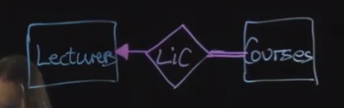

# 1. Introduction, Data Modelling, ER Notation
## Introduction
### General
- database: a collection of related data
- DBMS: database management system
- Database system: the database and DBMS together
- DBA: database administrator
### Database system languages
- DML: data manipulation language, such as queries, updates
- DDL: data defination language, such as data structure, constraints
- PL/SQL: Procedural Language/Structured Query Language
## Data Modleing
### ER: Entity Relationship
- attribute (column)
- entity(rows)
- relationship
### EDR entity relationship diagram
- [ER Diagram Representation](.\er_diagram_representation.pdf)
- 
- total participation
- partial participation
- one to one
- one to many
- many to many
### Keys
- PK: Primary key
    - one candidate key
    - unique
    - not null
    - never changing
- composite primary key
    - use fewest attribute
    - nerver changing
- FK: foreign key
    - a primary key stored in a foreign table
- superkey(keys): 
    - distinct
- candidate key: 
    - no subset is superkey
### Subclass
- overlapping
- disjoint
- partial
- total
# 2. Relational Model, ER-Relational Mapping, SQL Schemas
# 3. DBMSs, Databases, Data Modification
# 4. SQL Queries
# 5. More SQL Queries, Stored Procedures
# 6. Extending SQL: Queries, Functions, Aggregates, Triggers
# 7. More Triggers, Programming with Databases
# 8. Catalogs, Privileges
# 9. Relational Design Theory, Normal Forms
# 10. Relational Algebra, Query Processing
# 11. Transaction Processing, Concurrency Control