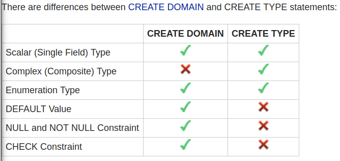

# COMP9311 Review

## 1. Introduction, Data Modelling, ER Notation

### General

- database: a collection of related data
- DBMS: database management system
- Database system: the database and DBMS together
- DBA: database administrator

### Database system languages

- DML: data manipulation language, such as queries, updates
- DDL: data definition language, such as data structure, constraints
- PL/SQL: Procedural Language/Structured Query Language

### ER: Entity Relationship

- attribute (column)
- entity(rows)
- relationship

### EDR entity relationship diagram

- [ER Diagram Representation](.\er_diagram_representation.pdf)
- 
- total participation
- partial participation
- one to one
- one to many
- many to many

### Keys

- PK: Primary key
  - one candidate key
  - unique
  - not null
  - never changing
- composite primary key
  - use fewest attribute
  - never changing
- FK: foreign key
  - a primary key stored in a foreign table
- superkey(keys):
  - distinct
- candidate key:
  - no subset is superkey
- weak entity:
  - In more technical terms it can be defined as an entity that cannot be identified
  
   by its own attributes. It uses a foreign key combined with its attributed to form the primary key.

### Subclass

- overlapping
- disjoint
- partial
- total

## 2. Relational Model, ER-Relational Mapping, SQL Schemas

### Relational Data Model

- a collection of inter-connected relations (or tables), must has a key
  - relation ~ table
  - tuple ~ row ~ record
  - attribute ~ column ~ field
- schema
  - description or definition of database
  - not expected to change frequently
  - a set of table and integrity constraint
- instance
  - a snapshot of database at a moment
  - all the integrity constraint are satisfied
- metadata
  - data about data
  - for example: schema

### Difference between ER and relational Model

- Rel has no composite or multi-valued attributes (atomic)
- Rel has no subclass or inheritance
- 
- 

```text

FavColour(12345, red)
FavColour(12345, green)
FavColour(12345, blue)
FavColour(54321, green)
FavColour(54321, purple)

```

### Mapping ER to relational model

- to be noticed:
  - this mapping lack of constraints
- binary relationship
  - 
  - 
  - 
    - a separate table is needed
- n-ways relationships
  - 

```postgreSQL

  -- Mapping of ER diagram with Prescription as relationship

create domain NameValue as varchar(100) not null;
--  character varying (100)

create table Drug (
  dno         integer, -- unique not null because PK
  name        NameValue unique, -- not null from domain
  formula     text,    -- can be null
  primary key (dno)
);

create table Patient (
  pid         integer,  -- unique not null because PK
  name        NameValue, -- not null from domain
  address     text not null,
  primary key (pid)
);

create table Doctor (
  tfn         integer, -- unique not null because PK
  name        NameValue, -- not null from domain
  specialty   text not null,
  primary key (tfn)
);

create table Prescribes (
  drug        integer references Drug(dno),
  doctor      integer not null references Doctor(tfn),
  patient     integer references Patient(pid),
  quantity    integer not null,
  "date"      date,
  primary key ("date",patient,drug)
  -- allows a patient to be prescribed
  -- a given drug only once on a given day
);

-- think about the implications of alternative primary keys
-- primary key(patient)
-- primary key(drug)
-- primary key("date")
-- primary key(patient,"date")
-- primary key(patient,"date",drug,doctor)

```

- 

```postgreSQL

-- Mapping of ER diagram with Prescription as an Entity

create domain NameValue as varchar(100) not null;
--  character varying (100)

create table Drug (
  dno         integer, -- unique not null because PK
  name        NameValue unique, -- not null from domain
  formula     text,    -- can be null
  primary key (dno)
);

create table Patient (
  pid         integer,  -- unique not null because PK
  name        NameValue, -- not null from domain
  address     text not null,
  primary key (pid)
);

create table Doctor (
  tfn         integer, -- unique not null because PK
  name        NameValue, -- not null from domain
  specialty   text not null,
  primary key (tfn)
);

create table Prescription (
  prNum       integer,
  "date"      date not null,
  doctor      integer not null references Doctor(tfn), -- n:1 relationship
  patient     integer not null references Patient(pid), -- n:1 relationship
  primary key (prNum)
);

create table PrescriptionItem (
  prescription integer references Prescription(prNum),
  drug         integer references Drug(dno),
  quantity     integer check (quantity > 0),
  primary key  (prescription,drug)
);

```

- 

```postgreSQL

---- Single-table mapping of subclasses ----
-- disjoint, total (i.e. each student belongs to exactly one subclass)
  ((degree is not null and major is null and thesis is null)
   or
   (degree is null and major is not null and thesis is null)
   or
   (degree is null and major is null and thesis is not null))

-- disjoint, partial (i.e. each student belongs to zero or one subclasses)
  ((degree is not null and major is null and thesis is null)
   or
   (degree is null and major is not null and thesis is null)
   or
   (degree is null and major is null and thesis is not null)
   or
   (degree is null and major is null and thesis is null))

-- overlapping, total (i.e. each student belongs to one or more subclasses)
  (degree is not null or major is not null or thesis is not null)

-- overlapping, partial (i.e. each student belongs to zero or more subclasses)
  -- no constraint needed


---- ER mapping of subclasses ----
-- as specified, only properly handles (overlapping, partial) case
-- to make it handle other cases correctly requires triggers

create table Student (
  sid integer primary key,
  name text,
  address text
);

create table Ugrad (
  sid integer references Student(sid),
  degree text,
  primary key (sid)
);

create table Masters (
  sid integer references Student(sid),
  major text,
  primary key (sid)
);

create table Research (
  sid integer references Student(sid),
  thesis text,
  primary key (sid)
);
```

### DBMS Terminology

- DBMS
- database
- schema
- table
- attribute

### Integrity Constraint

- Key constraint / entity constraint
  - unique, not null
- domain constraint
- referential constraint / foreign key constraint
  - the value must exist / or null
  - is a primary key in another table

## 3. DBMS, Databases, Data Modification

## 4. SQL Queries

### sub-languages

- Meta-data languages manage the schema.
- Data languages manipulate (sets of) tuples.
- Query languages are based on relational algebra.

### usage of quotes

- single-quotes are used for strings
- double-quotes used for "non-standard" identifiers

### datatype

- Numeric types:
  - integer
  - real
  - numeric(w, d)
- string types:
  - char(n)
  - varchar(n)
  - text
- logic types:
  - t, true, yes
  - f false, no
- time-related types:
  - date
  - time
  - timestamp
  - interval
- user-defained types:
  - `create domain name as type check (constraint)`
  - `create type name as (attrname attrtype)`
  - `create type name as enum (`lable` ...)`
  - 

```postgreSQL
create domain PositiveIntegerValue as
  integer check (value > 0);

create domain PersonAge as
  integer check (value >= 0 and value <= 200);
--	integer check (value between 0 and 200);

create domain UnswCourseCode as
  char(8) check (value ~ '[A-Z]{4}[0-9]{4}');
--	text check (value ~ '^[A-Z]{4}[0-9]{4}$');

create domain UnswSID as
  char(7) check (value ~ '[0-9]{7}');
--	integer check (value >= 1000000 and value <= 9999999);

create type IntegerPair as
  (x integer, y integer);

create domain UnswGradesDomain as
  char(2) check (value in ('FL','PS','CR','DN','HD'))
  -- CR < DN < FL < HD < PS

create type UnswGradesType as
  enum ('FL','PS','CR','DN','HD');
  -- FL < PS < CR < DN < HD
```

### SQL operations

- like operation
  - case sensitive
  - ilike (case insensitive)
  - ~ like
  - !~ not like
  - % means .*
  - _ means .
  - ^ begin with
  - $ end with
- String manipulation
  - str1 || str2: concatenation, return Null if neither str1 or str2 is NULL
  - lower(str)
  - substring(str, start, count)
- arithmetic operations
  - abs
  - ceil
  - floor
  - power
  - sqrt
  - sin
- aggregation
  - count
  - sum
  - avg
  - min
  - max
- NULL
  - 

### SQL conditional expressions

- coalesce(val1, val2 ..): return first non-null value
- nullif(val1, val2): return null if val1 = val2
- conditional expression:

```postgreSQL
CASE
   WHEN test1 THEN result1
   WHEN test2 THEN result2
   ...
   ELSE resultn
END
```

### Schema

- create or drop table

```postgreSQL
CREATE TABLE RelName (
    attribute1   domain1   constraints1,
    attribute2   domain2   constraints2,
    ...
    table-level constraints, ...  --primary key, foreign key...
);

DROP TABLE RelName
```

- serial integer

```postgreSQL
CREATE TABLE R (
   id SERIAL PRIMARY KEY, ...
);

INSERT INTO R VALUES ( DEFAULT, ...);
```

- delete foreign key
  - reject the deletion   (PostgreSQL default behaviour)
  - set-NULL the foreign key attributes in Account records
  - cascade the deletion and remove Account records

- insert foreign key

```postgreSQL
create table R (
  id integer primary key,
  s char(1) references S(id) deferrable
);

create table S (
  id char(1) primary key,
  r integer references R(id) deferrable
);

begin;
set constraints all deferred;
insert into R values (1,'a');
insert into S values ('a',2);
insert into R values (2,'b');
insert into S values ('b',2);
commit;
```

- RDBMS-specific programming languages
  - Oracle's PL/SQL
  - PostgreSQL's PLpgSQL

- SQL suery

```postgreSQL
SELECT   projectionList
FROM     relations/joins
WHERE    condition
GROUP BY groupingAttributes
HAVING   groupCondition

result: table, one value, empty
```

- SQL different join

```postgreSQL
-- compare the differences in the results of the following:

-- select * from R natural join S;
x	y	z
1	abc	a
1	abc	c
3	ghi	b

-- select * from R join S on (R.x = S.x);  -- join means inner join (inner is optional and is the default)
x	y	z	x
1	abc	a	1
1	abc	c	1
3	ghi	b	3

-- select * from R, S where R.x = S.x;
x	y	z	x
1	abc	a	1
1	abc	c	1
3	ghi	b	3

-- select * from R left outer join S on (R.x = S.x);  -- outer not compulsory when left, right, and full are used
x	y	z	x
1	abc	a	1
1	abc	c	1
2	def
3	ghi	b	3

-- select * from R right outer join S on (R.x = S.x);
x	y	z	x
1	abc	a	1
1	abc	c	1
3	ghi	b	3
    d

-- select * from R full outer join S on (R.x = S.x);
x	y	z	x
1	abc	a	1
1	abc	c	1
2	def
3	ghi	b	3
    d
```

## 5. More SQL Queries, Stored Procedures

### SQL function

```postgreSQL
create or replace function
  add2a(a integer, b integer)
  returns integer
as
$$
select a+b;
$$
language 'sql';


create or replace function
  add2a(a integer, b integer)
  returns integer
as
$$
begin
  return a + b;
end;
$$
language 'plpgsql';


create type pair as (x integer, y integer);

create or replace function
  mkpair(a integer, b integer)
  returns pair
as
$$
declare
  p pair;
begin
  p.x := a;
  p.y := b;
  return p;
end;
$$
language 'plpgsql'


create or replace function
  seq(hi integer)
  returns setof integer
as
$$
declare
  i integer;
begin
  i :=1;
  while (i <= hi) loop
    return next i;
    i := i + 1;
  end loop;
  return;
end;
$$
language 'plpgsql'


create or replace function
  squares(hi integer)
  returns setof pair
as
$$
declare
  i integer;
  p pair;
begin
  for i in 1..hi loop
    p.x = i;
    p.y = i*i;
    return next p;
  end loop;
  return;
end;
$$
language 'plpgsql'
```

### function return type

- create function factorial(integer) returns integer ...
- create function EmployeeOfMonth(date) returns Employee ...
- create function allSalaries() returns setof float ...
- create function OlderEmployees() returns setof Employee ...


## 6. Extending SQL: Queries, Functions, Aggregates, Triggers

### function mode

- immutable ... does not access database (fast)
- stable ... does not modify the database
- volatile ... may change the database (slow, default)

### function type

- Window Functions(Group-by)

```postgreSQL
select student,avg(mark) ... group by student

 student  |  avg
----------+-------
 46000936 | 64.75
 46001128 | 73.50


select *,avg(mark) over (partition by student) ...

 student  | course | mark | grade | stueval |  avg
----------+--------+------+-------+---------+-------
 46000936 |  11971 |   68 | CR    |       3 | 64.75
 46000936 |  12937 |   63 | PS    |       3 | 64.75
 46000936 |  12045 |   71 | CR    |       4 | 64.75
 46000936 |  11507 |   57 | PS    |       2 | 64.75
 46001128 |  12932 |   73 | CR    |       3 | 73.50
 46001128 |  13498 |   74 | CR    |       5 | 73.50
 46001128 |  11909 |   79 | DN    |       4 | 73.50
 46001128 |  12118 |   68 | CR    |       4 | 73.50
```

- with queries(temporary view)

```postgreSQL
with V as (select a,b,c from ... where ...),
     W as (select d,e from ... where ...)
select V.a as x, V.b as y, W.e as z
from   V join W on (v.c = W.d);
```

### User-defined Aggregates

```postgreSQL
create function
  onemore(sum integer, x anyelement)
  returns integer
as
$$
begin
  if x is null then
    return sum + 1;
  else
    return sum + 1;
  end if;
end;
$$language plpgsql;

create aggregate countall(anyelement)
(
  stype = integer,  --state type
  initcond = 0,     --initial value
  sfunc = oneMore   --new state function
);
```

### Triggers

```postgreSQL
CREATE TRIGGER TriggerName
{AFTER|BEFORE}  Event1 [ OR Event2 ... ]
[ FOR EACH ROW ]
ON TableName
[ WHEN ( Condition ) ]
Block of Procedural/SQL Code ;

create trigger checkstate
before insert or update
for each row
on Person
execute procedure checkstate();

create function checkstate()
  returns trigger
 as $$
  new.state = upper(trim(new.state);
  if (new.state !~ '^[A-Z][A-Z]$') then
    raise exception 'Code must be two alpha chars';
   end if;
   select * from State where code=new.state
   if (not found) then
    raise exception 'invalid code %', new.state;
   end if;
   return new;
 $$ language plpgsql;
 
 
 -- New employee
 create trigger TotalSalary1
 after insert on Employees
 for each row
 excute procedure totalsalary1();
 
 create function total salary()
 returns trigger
 as $$
 begin
  if (new.dept is not null) then
    update Department
      set totsal = totsal + new.salary
      where Department.id = new.dept;
   end if;
  return news;
 end;
 $$ language plpgsql;
 
 -- Change department
 create trigger totalsalary2
 after update on Employee
 for each row
 excute procedure totalsalary2();
 
 create function totalsalary2()
 returns trigger
 as $$
  begin
    update Department
      set totsal = totsal + new.salary
      where department.id = new.department;
    update Department
      set totsal = totsal - old.salary
      where department.id = old.department;
    return new;
  end;
 $$ language plpgsql;
 
 
- employee leave
create trigger totalsalary3
after delete on employee
for each row
execte procedure totalsalary3();

create function totalsalary3()
returns trigger
as $$
  begin
    if (old.dept is not null) then
      update department
        set total = total - old.salary
        where department.id = old.dept;
     end if;
     return old;
  end;
$$ language plpgsql;
```

### Event

- INSERT
  - before
    - check(modify) values of NEW
    - constraint checking
    - if failds, abort and rollback
  - after
    - check values via NEW, 
    - modify other tables to satisfy constraints
- DELETE
  - before
     - access current tuple via OLD
     - constraint checking
     - if failds, abort and rollback
  - after
     - access current tuple via OLD
     - modify other tables to satisfy constraints
- UPDATE
  - before
    - access current tuple via OLD
    - check(modify) values of NEW
    - constraint checking
    - if failds, abort and rollback
  - after
    - check values via NEW, 
    - modify other tables to satisfy constraints

## 7. More Triggers, Programming with Databases

## 8. Catalogs, Privileges

## 9. Relational Design Theory, Normal Forms

## 10. Relational Algebra, Query Processing

## 11. Transaction Processing, Concurrency Control
